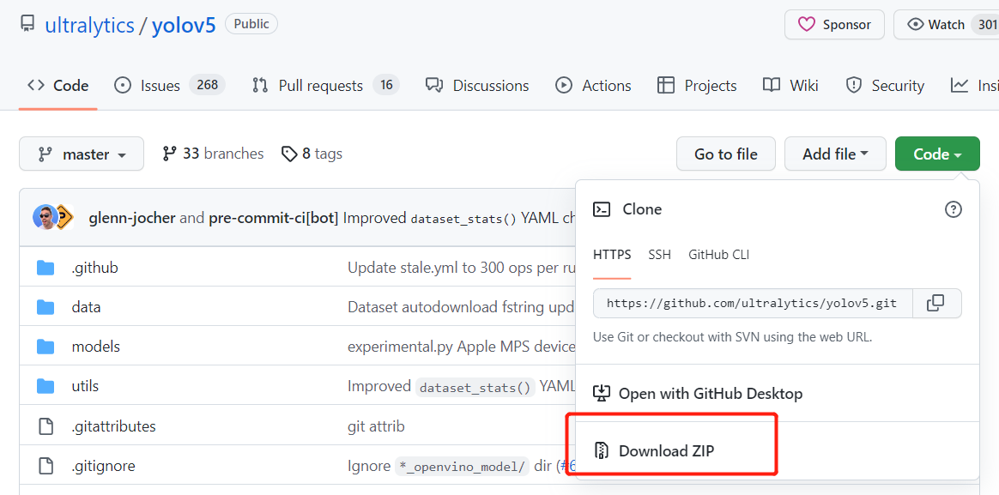

# download

## 1 从GitHub上下载资源

- 将资源下载至本地
    

    
详情
  
        
    - 下载zip压缩包（Windows下建议使用）
    
    - 利用命令行下载资源（Linux下建议使用）  
    在命令行中输入`git clone ziyuan_address`，ziyuan_address参考以下
    
    

- 将资源fork自己的项目中
    

    
详情
  
            
    点击别人项目中的Fork  
      
    这样，在我们自己的项目中就拥有了别人的项目\狗头。
    

## 附件链接
- [从GitHub上下载资源](./download.md)
- [本地资源上传至GitHub](./upload.md)
- [项目更新](./up_to_date.md)
- [Git使用常见问题](./Q%26A.md)
