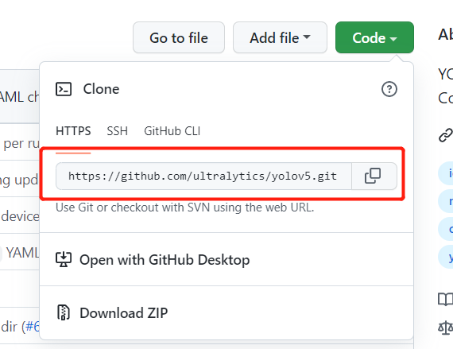

# download

## 1 从GitHub上下载资源

详情
  
  
### 0） 将资源下载至本地
- 下载zip压缩包（Windows下建议使用）

- 利用命令行下载资源（Linux下建议使用）
在命令行中输入`git clone ziyuan_address`，ziyuan_address参考以下

### 1） 将资源fork自己的项目中
  
这样，在我们自己的项目中就拥有了别人的项目\狗头。
  

## 附件链接
- [从GitHub上下载资源](https://github.com/dazhuang17/Github_User_Guide/blob/main/git_user_guide/download.md)
- [本地资源上传至GitHub](https://github.com/dazhuang17/Github_User_Guide/blob/main/git_user_guide/upload.md)
- [项目更新](https://github.com/dazhuang17/Github_User_Guide/blob/main/git_user_guide/up_to_date.md)
- [Git使用常见问题](https://github.com/dazhuang17/Github_User_Guide/blob/main/git_user_guide/Q%26A.md)
